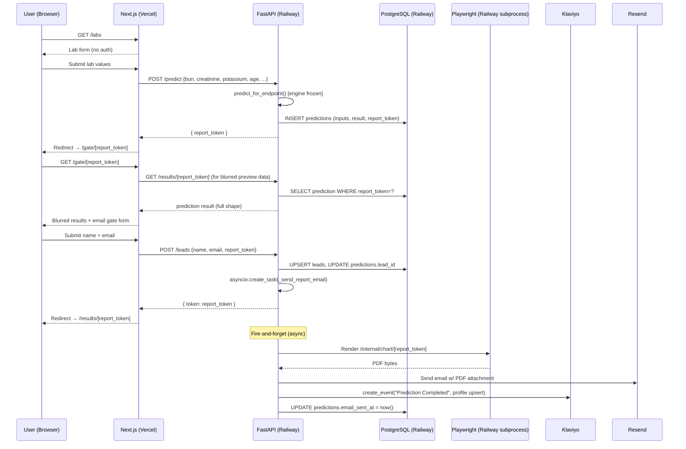

# KidneyHood — New Patient Flow Technical Specification

**Author:** Luca (CTO)
**Date:** 2026-04-19
**Status:** Approved — all open questions resolved 2026-04-19 (see §13). Ready for engineer dispatch.
**Purpose:** Implementation-ready spec for the no-auth tokenized flow replacing the current Clerk-gated predict/results path
**Scope:** Frontend (Next.js 16), Backend (FastAPI/Railway), DB (PostgreSQL/Railway), Email (Resend + Klaviyo)

---

## 1. Executive Summary

The current patient flow (`/predict` → Clerk sign-in → `/results`) uses full Clerk authentication for patients who have no need for an account. This spec replaces it with a no-auth, tokenized funnel:

**Landing → `/labs` → POST /predict → Email Gate → POST /leads → `/results/[token]`**

The prediction engine (Lee v2.0, PR #28) is not touched. The change is architectural: (1) results are now stored server-side keyed by an opaque token, (2) email capture happens after prediction via a separate form step, (3) Clerk is scoped to the `/client/[slug]` dashboard only, and (4) the report PDF is generated from stored inputs and attached to a Resend transactional email.

Critical constraints:
- **Engine frozen.** `backend/prediction/engine.py` and its `predict_for_endpoint()` wrapper are not modified.
- **No Jira cards in this doc.** Ticket breakdown is in Section 12 — EM dispatches after sign-off.
- **Write scope.** Only `agents/luca/drafts/` is touched by this spec; engineers write to their own paths.

---

## 2. Flow Comparison

### Current (to be removed)

```
Landing Page
  └─ CTA → /predict
               ├─ Clerk sign-in wall (unauthenticated users blocked)
               ├─ Lab values + name + email collected in one form
               ├─ POST /predict → engine runs → result stored in sessionStorage only
               └─ window.location.href = "/results"
                    └─ Results page reads sessionStorage
                         └─ PDF: re-POSTs inputs to /predict/pdf
```

### New (this spec)

```
Landing Page
  └─ CTA → /labs (new page, no auth)
               └─ Lab values only (BUN, Creatinine, Potassium, Age + optional Hb, Glucose)
               └─ Submit → POST /predict
                               └─ engine runs, result stored in DB (predictions table)
                               └─ returns { report_token }
               └─ redirect → /gate/[token] (email gate)
                               └─ Name + email form over blurred results preview
                               └─ Submit → POST /leads
                                               └─ Upsert lead, link to prediction
                                               └─ fire-and-forget: Klaviyo event + Resend email w/ PDF
                                               └─ returns { token }
               └─ redirect → /results/[token]
                               └─ fetch GET /results/[token]
                               └─ Display chart + stat cards
                               └─ PDF button → GET /reports/[token]/pdf
```

---

## 3. System Architecture Diagram



---

## 4. Database Schema Changes

### 4.1 New `predictions` Table

```sql
CREATE TABLE predictions (
    id              UUID PRIMARY KEY DEFAULT gen_random_uuid(),
    report_token    TEXT NOT NULL UNIQUE,
    token_created_at TIMESTAMPTZ NOT NULL DEFAULT now(),
    revoked_at      TIMESTAMPTZ,                          -- NULL = active; unused in MVP
    inputs          JSONB NOT NULL,                       -- raw validated inputs from POST /predict
    result          JSONB NOT NULL,                       -- full PredictResponse payload
    lead_id         UUID REFERENCES leads(id) ON DELETE SET NULL,  -- NULL until email gate passes
    email_sent_at   TIMESTAMPTZ,                          -- NULL until Resend delivery confirmed
    created_at      TIMESTAMPTZ NOT NULL DEFAULT now()
);

CREATE INDEX idx_predictions_report_token ON predictions(report_token);
CREATE INDEX idx_predictions_lead_id      ON predictions(lead_id);
CREATE INDEX idx_predictions_created_at   ON predictions(created_at);
```

**Token design:** `report_token` = `secrets.token_urlsafe(32)` (43 chars, 256 bits of entropy). Generated in the API handler, not the engine. Opaque — no JWT, no HMAC. Revocation via `revoked_at` column (set but not enforced in MVP; reserved for future use).

**TTL policy (MVP):** No hard expiry enforced server-side in MVP. Tokens do not expire. Add expiry logic in a follow-on card if Lee requires it.

**Pre-consent storage justification (HIPAA):** A `predictions` row created before email capture contains only anonymous lab values and a random token — no name, no email, no DOB, no geographic identifier. This does not constitute PHI under HIPAA 45 CFR §164.514. The row becomes linkable to an individual only after `lead_id` is populated (POST /leads step). Existing BAA gap with Railway is documented in `agents/yuri/drafts/hipaa-verification-notes.md` and is unchanged by this spec.

### 4.2 `leads` Table — No Changes

The existing `leads` schema is preserved as-is. The new FK relationship runs from `predictions.lead_id → leads.id`, not the reverse. This keeps the leads table unchanged and avoids a migration that touches existing data.

### 4.3 Migration

One forward migration:

```sql
-- Migration: 0005_add_predictions_table.sql
-- Apply via: alembic upgrade head
-- Safe to run against live DB (new table only, no modifications to existing tables)
```

No rollback risk to existing `leads` data.

---

## 5. Endpoint Contracts

### 5.1 POST /predict

**Purpose:** Run the prediction engine, store result, return an opaque token.
**Auth:** None. Rate-limited by slowapi (10 req/min per IP — matches current limit).
**Change from current:** Adds DB write; removes name/email fields from request body.

**Request:**
```typescript
interface PredictRequest {
  bun:         number;  // 5–100, integer
  creatinine:  number;  // 0.3–20.0
  potassium:   number;  // 2.0–8.0
  age:         number;  // 18–120, integer
  hemoglobin?: number;  // 4.0–20.0, optional
  glucose?:    number;  // 40–500, optional
}
```

Validation rules are unchanged from `app/src/lib/validation.ts` `PREDICT_FORM_RULES` + `TIER2_FORM_RULES`. Sex field remains absent (engine uses "unknown" internally).

**Response (200):**
```typescript
interface PredictResponse {
  report_token:      string;          // 43-char opaque token
  egfr_baseline:     number;
  confidence_tier:   string;
  trajectories:      number[][];      // 4 × 15 points [bun_12, bun_13_17, bun_18_24, no_treatment]
  time_points_months: number[];       // [0, 1, 2, 3, 6, 9, 12, 15, 18, 21, 24, 30, 36, 48, 60]
  dial_ages:         number[];        // 4 values
  dialysis_threshold: number;         // 12
  stat_cards:        StatCard[];
}

interface StatCard {
  label: string;
  value: string | number;
  unit?:  string;
}
```

The full prediction payload (all fields except `report_token`) is written to `predictions.result` as JSONB. `predictions.inputs` stores the validated request body.

**Error responses:**
```
422 Unprocessable Entity  — Pydantic validation failure (field out of range, wrong type)
429 Too Many Requests     — rate limit hit
500 Internal Server Error — engine failure or DB write failure
```

On 500: the prediction result is NOT returned. Client shows a generic error state. No partial token is issued.

---

### 5.2 GET /results/[token]

**Purpose:** Fetch a stored prediction result by token.
**Auth:** None. Token IS the authorization credential.
**Path param:** `token` — the `report_token` value from POST /predict.

**Response (200):**
```typescript
// Same shape as PredictResponse above, minus report_token
// Full result JSONB from predictions.result, deserialized
interface ResultsResponse extends Omit<PredictResponse, 'report_token'> {
  captured: boolean;  // true if lead_id is populated (email gate completed)
}
```

The `captured` boolean lets the frontend decide whether to show the email gate or display results directly (e.g., returning user via emailed link).

**Error responses:**
```
404 Not Found             — token does not exist in DB
410 Gone                  — token exists but revoked_at IS NOT NULL
```

**Note:** No auth check needed. The token is 256-bit random — brute force is not a realistic threat vector.

---

### 5.3 POST /leads

**Purpose:** Capture name + email, link to prediction, trigger email + Klaviyo.
**Auth:** None. Rate-limited (5 req/min per IP — tighter than /predict because email delivery is expensive).
**Change from current:** Accepts `report_token`; existing POST /leads (lead write from predict step) is merged into this flow.

**Request:**
```typescript
interface LeadRequest {
  name:         string;   // 1–100 chars, trimmed
  email:        string;   // valid email format
  report_token: string;   // must exist in predictions table
}
```

**Response (200):**
```typescript
interface LeadResponse {
  token: string;  // echo of report_token — client redirects to /results/[token]
}
```

**Server-side behavior (in order):**
1. Validate name + email + report_token (Pydantic).
2. Verify `predictions` row exists for `report_token` and `revoked_at IS NULL` — 404 if not found, 410 if revoked.
3. `UPSERT leads (email) SET name=..., updated_at=now()` — idempotent on email.
4. `UPDATE predictions SET lead_id=leads.id WHERE report_token=...`
5. `asyncio.create_task(_send_report_email(prediction_id, lead_id))` — fire-and-forget.
6. Return `{ token: report_token }`.

**`_send_report_email` (async, fire-and-forget):**
```
1. Fetch predictions.inputs from DB
2. POST to /internal/chart/[token] via Playwright → get PDF bytes
3. Send Resend email:
   - to: lead.email
   - subject: "Your Kidney Health Report"
   - html: email template (see Section 9)
   - attachment: { filename: "kidney-report.pdf", content: <base64 pdf bytes> }
4. UPDATE predictions.email_sent_at = now()
5. fire Klaviyo create_event("Prediction Completed", profile upsert):
   - unique_id: f"pred_{prediction_id}"
   - profile: { email, name, $first_name, ... }
   - properties: { egfr_baseline, confidence_tier, report_url }
```

**PDF failure handling:** If Playwright fails (timeout or render error), log the error, send the Resend email WITHOUT the attachment, include an in-app link: `https://kidneyhood-automation-architecture.vercel.app/results/[token]`. Do not block email delivery on PDF success. `email_sent_at` is still set.

**Klaviyo failure handling:** Klaviyo is fully fire-and-forget. Log the exception. Do not retry in MVP (Klaviyo SDK has its own internal retry). Do not surface Klaviyo failures to the user.

**Error responses:**
```
404 Not Found             — report_token not found in predictions
410 Gone                  — prediction is revoked
422 Unprocessable Entity  — invalid email format, missing fields
429 Too Many Requests     — rate limit
```

---

### 5.4 GET /reports/[token]/pdf

**Purpose:** Serve the PDF for the in-app "Download PDF" button.
**Auth:** None. Token IS the authorization credential.
**Change from current:** Replaces POST /predict/pdf (which re-ran the engine). This endpoint reads inputs from DB and renders via Playwright — no engine re-run.

**Response:**
```
200 OK
Content-Type: application/pdf
Content-Disposition: attachment; filename="kidney-health-report.pdf"
Body: PDF bytes
```

**Server-side behavior:**
1. Fetch `predictions` row by `report_token` (404/410 on miss/revoked).
2. Run Playwright: `await page.goto(f"{FRONTEND_INTERNAL_URL}/internal/chart/{token}?secret={PDF_SECRET}")`
3. Stream PDF bytes back to client.

**Note:** The `/internal/chart/[token]` route on the frontend must be created (see Section 7.3). It fetches the stored result by token and renders the chart statically — no form state needed.

**Timeout:** Playwright render budget = 30s. Return 504 if exceeded. Client shows toast with fallback link.

---

### 5.5 Existing Endpoints — No Changes

| Endpoint | Status |
|----------|--------|
| GET /leads | Unchanged (admin) |
| POST /webhooks/clerk | Unchanged (dormant, keep for dashboard webhook) |
| GET /health | Unchanged |

---

## 6. Clerk Migration Plan

### Current state
`ClerkProvider` wraps the entire app in `app/src/app/layout.tsx`. `signInFallbackRedirectUrl="/predict"` redirects unauthenticated patients to the predict form. The `/predict` page uses `useUser()` / `useAuth()` hooks.

### Target state
Clerk is scoped to `/client/[slug]` only. The patient funnel (`/labs`, `/gate/[token]`, `/results/[token]`) has no Clerk dependency.

### Migration steps (Harshit owns)

**Step 1 — Create `/client/[slug]/layout.tsx`**

Move `ClerkProvider` from root layout into a new nested layout at `app/src/app/client/[slug]/layout.tsx`. This layout wraps only the client dashboard subtree.

```typescript
// app/src/app/client/[slug]/layout.tsx
import { ClerkProvider } from '@clerk/nextjs';
export default function ClientLayout({ children }) {
  return <ClerkProvider>{children}</ClerkProvider>;
}
```

**Step 2 — Gut root layout**

Remove `ClerkProvider` from `app/src/app/layout.tsx`. Remove `signInFallbackRedirectUrl`. Root layout becomes a plain shell with metadata and global styles.

**Step 3 — No middleware to touch**

`middleware.ts` does not exist in this repo (confirmed). No Clerk route matchers to update.

**Step 4 — Verify `/client/lee-a3f8b2` still works**

The client dashboard page uses Clerk `useUser()`. With ClerkProvider now in the nested layout, it must still resolve. Playwright smoke test: load `/client/lee-a3f8b2`, verify dashboard renders. This is a non-negotiable QA gate before this PR merges.

**Step 5 — Remove `@ts-nocheck` pattern**

The new `/labs` page must not use `@ts-nocheck`. All Clerk types were the reason for the suppressor on `/predict`. With Clerk gone from the patient funnel, no suppressor is needed.

**Step 6 — Delete `/predict` and `/results` (old pages)**

After new pages are deployed and smoke-tested, delete `app/src/app/predict/` and `app/src/app/results/` (the old sessionStorage-based pages). Do this in a separate PR after the new pages are live.

---

## 7. Frontend Pages

### 7.1 `/labs` (replaces `/predict`)

**File:** `app/src/app/labs/page.tsx`
**Auth:** None — no `useUser()`, no `useAuth()`, no ClerkProvider in scope.
**Form fields:**

| Field | Type | Required | Validation |
|-------|------|----------|------------|
| BUN | number | Yes | 5–100, integer |
| Creatinine | number | Yes | 0.3–20.0 |
| Potassium | number | Yes | 2.0–8.0 |
| Age | number | Yes | 18–120, integer |
| Hemoglobin | number | No (Tier 2) | 4.0–20.0 |
| Glucose | number | No (Tier 2) | 40–500 |

Reuse `validateField()` and `validateForm()` from `app/src/lib/validation.ts` (existing, unchanged).

**Design source:** `Email Gate.html` and `Lab Form.html` in the Claude Design bundle at `/tmp/kh-design/kidneyhood/project/`. Inga owns pixel-perfect translation.

**Submit behavior:**
1. Client-side validation — show field errors inline on blur + on submit.
2. POST `/predict` with validated values.
3. On success: `router.push('/gate/' + data.report_token)`.
4. On 422: map Pydantic error detail to field-level errors.
5. On 429: show "Too many attempts — try again in a minute" toast.
6. On 500: show "Something went wrong — please try again" toast with retry button.
7. Submit button shows loading spinner during fetch; disabled on pending.

**No sessionStorage writes.** The token from POST /predict is the only thing passed forward — via URL.

---

### 7.2 `/gate/[token]` (new — Email Gate)

**File:** `app/src/app/gate/[token]/page.tsx`
**Auth:** None.
**Purpose:** Capture name + email over a blurred results preview.

**Load behavior:**
1. On mount: fetch `GET /results/[token]`.
   - If `captured: true` (email already captured): redirect immediately to `/results/[token]`.
   - If `captured: false`: render gate UI.
   - If 404/410: show "This report link is invalid or has expired" error page with CTA back to `/labs`.
2. Render blurred/dimmed chart preview using fetched result data (eGFR baseline, trajectory shape). The blur is CSS — the actual data is present in the DOM, which is acceptable since the token is already in the URL and a determined user could just navigate directly to `/results/[token]`. The gate is UX friction, not a security barrier.

**Form fields:**
| Field | Type | Required | Validation |
|-------|------|----------|------------|
| Name | text | Yes | 1–100 chars |
| Email | email | Yes | Valid email format |

**Submit behavior:**
1. POST `/leads` with `{ name, email, report_token: token }`.
2. On success: `router.push('/results/' + token)`.
3. On 422: show field errors.
4. On 429: show rate limit toast.

**Design source:** `Email Gate.html` in the Claude Design bundle.

---

### 7.3 `/results/[token]` (replaces `/results`)

**File:** `app/src/app/results/[token]/page.tsx`
**Auth:** None.
**Purpose:** Display full prediction results.

**Load behavior:**
1. On mount: fetch `GET /results/[token]`.
   - If `captured: false`: redirect to `/gate/[token]` (user bookmarked or navigated directly without completing gate).
   - If 404/410: show error page.
2. Render chart, stat cards, scenario pills using fetched `result` payload.

**No sessionStorage reads.** All data comes from the API.

**PDF download button:** Issues a GET request to `/reports/[token]/pdf`. Opens in new tab or triggers browser download (use `<a href="/reports/[token]/pdf" target="_blank">`). No JS needed for basic case.

**"Edit info" button:** Returns to `/labs` (not `/predict`). Does NOT pre-populate form (a fresh prediction is preferred over editing a stored one — prevents token collision confusion).

**Design source:** `Results.html` in the Claude Design bundle.

---

### 7.4 `/internal/chart/[token]` (new — Playwright render target)

**File:** `app/src/app/internal/chart/[token]/page.tsx`
**Auth:** Query param `?secret={PDF_SECRET}` — validated server-side in the page's `generateMetadata` or via middleware if added later. In MVP, validate secret in the page component and return 403 if missing/wrong.
**Purpose:** Static render of the chart for Playwright PDF capture. No nav, no CTAs, clean white background.

**Load behavior:**
1. Validate `?secret` query param against `process.env.PDF_SECRET`.
2. Fetch `GET /results/[token]` from FastAPI backend.
3. Render chart + stat cards in a fixed 1200×900 viewport layout (matches current Playwright config).

**Important:** This page must SSR or use `loading.tsx` carefully — Playwright waits for `networkidle`. Avoid lazy-loaded chart components that cause additional network requests after the initial render.

---

## 8. Backend Implementation Notes

### 8.1 File Ownership (John Donaldson)

All backend changes are in `backend/main.py` and `backend/alembic/`. `backend/prediction/engine.py` is not touched.

### 8.2 POST /predict Handler Changes

Current handler: collects name+email, runs engine, calls `_write_lead()`, returns full result.

New handler:
1. Remove name + email from request model.
2. Run `predict_for_endpoint()` (unchanged).
3. Generate `report_token = secrets.token_urlsafe(32)`.
4. INSERT into `predictions`: inputs, result (full PredictResponse dict minus token), report_token, created_at.
5. Return `{ report_token, ...full_result }` — same response shape as before, plus `report_token` added.

**Why return full result from POST /predict?** The gate page needs to render the blurred preview immediately on redirect without a second API call. The frontend caches this in React state (not sessionStorage) during the `/gate/[token]` session. If the user refreshes the gate page, it fetches `GET /results/[token]`.

### 8.3 Existing `_write_lead()` Pattern

Current `_write_lead()` fire-and-forget in `main.py` is retired from the predict endpoint. POST /leads becomes the explicit lead-write step. The `_send_report_email()` async function follows the same `asyncio.create_task()` pattern as the current `_write_lead()`.

### 8.4 Resend Integration (new)

**Package:** `resend` (PyPI). Add to `backend/requirements.txt`.
**Env var:** `RESEND_API_KEY` — provision in Railway dashboard.
**From address:** `reports@kidneyhood.com` or `noreply@kidneyhood.com` — **[OPEN QUESTION #1]** — Brad to confirm sending domain.
**Attachment limit:** Resend supports up to 40MB attachments. Playwright PDFs are ~200KB. No concern.

```python
# Pseudocode — do not implement literally
import resend

resend.api_key = os.environ["RESEND_API_KEY"]
resend.Emails.send({
    "from": "KidneyHood Reports <reports@kidneyhood.com>",
    "to": lead_email,
    "subject": "Your Kidney Health Report",
    "html": render_email_template(name, token),
    "attachments": [{"filename": "kidney-report.pdf", "content": base64_pdf}],
})
```

### 8.5 Klaviyo Integration (existing pattern, new call site)

`KLAVIYO_PRIVATE_API_KEY` already on Railway. Call is identical to LKID-47 spec in `Resources/klaviyo-docs-summary.md`. Move the call from the predict endpoint into `_send_report_email()`.

```python
event_properties = {
    "egfr_baseline": result["egfr_baseline"],
    "confidence_tier": result["confidence_tier"],
    "report_url": f"https://kidneyhood-automation-architecture.vercel.app/results/{token}",
}
```

### 8.6 CORS Update

Current: `allow_credentials=False`. No change needed — the new endpoints don't use cookies.

---

## 9. Email Template

**File:** `backend/templates/report_email.html` (new)
**Rendering:** Jinja2 (already available in Python stdlib-adjacent; FastAPI projects commonly use `jinja2` package — add to requirements if not present).
**Variables:** `{{ name }}`, `{{ token }}`, `{{ egfr_baseline }}`, `{{ report_url }}`

Template structure (adapted from `Email Template.html` from Claude Design bundle):
- KidneyHood brand header (navy background, logo)
- "Hi {{ name }}," greeting
- Plain-language summary of eGFR baseline
- **"Your PDF report is attached to this email."** — no CTA button, no "view online" link (per Brad's answer to OQ-5: PDF attachment is the deliverable; the email stands alone)
- Disclaimer footer (matches text from LKID-5 disclaimers PR #22)
- Plain-text unsubscribe / contact footer (Resend transactional emails don't require List-Unsubscribe headers, but include a human-readable note)

**Fallback only:** if PDF render fails (see §4.2 "PDF failure handling"), the email falls back to including an in-app link to `/results/[token]` as the ONLY way the user can reach their report. This is explicitly not the default path.

**Note:** Klaviyo's warm-campaign emails (separate from this transactional email) may include `report_url` in their templates since they're marketing follow-ups, not the primary report delivery. That's a Klaviyo Flow-design decision, not part of this spec.

---

## 10. Rollout Strategy

### Single coordinated release (not incremental)

Because this change removes Clerk from the patient funnel and renames the primary routes (`/predict` → `/labs`, `/results` → `/results/[token]`), a phased rollout would require maintaining both the old and new flows simultaneously, including double the API contracts and sessionStorage + DB write paths. The complexity cost exceeds the rollback benefit for an app with low concurrent traffic.

**Recommended:** Single release. All PRs merged in dependency order. Old pages deleted in the final PR.

### PR dependency order

```
PR A — Gay Mark: DB migration (predictions table)
  └─ PR B — John: POST /predict update + GET /results/[token] + POST /leads + GET /reports/[token]/pdf
       └─ PR C — Harshit: Clerk migration (ClerkProvider → nested layout) + /labs page + /gate/[token] + /results/[token] + /internal/chart/[token]
            └─ PR D — Harshit: Delete old /predict and /results pages (only after smoke test passes)
```

PR A can merge independently. PR B depends on A (DB schema must exist). PR C depends on B (needs new endpoint). PR D depends on C + smoke test gate.

### Rollback plan

If production breaks after PR B or C:
1. Revert the merged PR via `gh pr revert` — GitHub creates a revert PR automatically.
2. The `predictions` table exists but is unpopulated — no data loss.
3. Old pages are still live until PR D merges — they'll work again after revert.

If production breaks after PR D (old pages deleted):
1. Restore deleted pages from git history.
2. This is the only irreversible step — don't merge PR D until `/results/[token]` has been smoke-tested in production for at least 24 hours.

### Vercel preview deploy

Each PR gets a Vercel preview URL automatically.

**No staging environment** (Brad's answer to OQ-2). PRs A and B must be deployed to production Railway before PR C's Vercel preview can be fully smoke-tested end-to-end. Rollout procedure:

1. Merge PR A → Railway auto-deploys the migration.
2. Merge PR B → Railway auto-deploys the new endpoints. Existing `/predict` endpoint is backwards-compatible until PR D lands.
3. Open PR C. Its Vercel preview hits prod Railway. Yuri smoke-tests the new flow against live data (use a disposable test email).
4. Merge PR C → `/labs`, `/gate/[token]`, `/results/[token]` go live. Old `/predict` page still works because PR D hasn't landed.
5. Wait ≥24 hrs, confirm no issues, merge PR D to delete the old pages.

---

## 11. Test Impact

### 11.1 E2E Tests (`app/tests/e2e/prediction-flow.spec.ts`)

Required changes — Yuri owns:

| Current | Replacement |
|---------|-------------|
| `goto('/predict')` | `goto('/labs')` |
| Fill name + email + labs in one form | Fill labs only on `/labs`; fill name + email on `/gate/[token]` |
| Mock `**/predict` POST | Mock `**/predict` POST (same path, new response shape with `report_token`) |
| `waitForURL('**/results')` | `waitForURL('**/gate/**')` then `waitForURL('**/results/**')` |
| `VALID_PREDICTION_RESPONSE` mock | Add `report_token: "test-token-abc123"` to mock shape |
| PDF test re-POSTs to `/predict/pdf` | PDF test navigates to `/reports/[token]/pdf` |

The test flow becomes a two-step sequence: labs form → gate form → results page.

### 11.2 Accessibility Tests (`app/tests/a11y/accessibility.spec.ts`)

| Current | Replacement |
|---------|-------------|
| `goto('/predict')` | `goto('/labs')` |
| `goto('/results')` | `goto('/results/test-token-abc123')` (mock result fetch) |

Add a11y test for `/gate/[token]` (new page, not currently covered).

### 11.3 Backend Tests

New tests needed (Gay Mark + John):
- `test_predictions_table.py`: INSERT, SELECT by token, 404 on missing token, 410 on revoked token.
- `test_post_predict_stores_result.py`: POST /predict returns `report_token`, verify DB row written.
- `test_post_leads_links_prediction.py`: POST /leads with valid token updates `predictions.lead_id`.
- `test_get_results_by_token.py`: GET /results/[token] returns correct payload; `captured` bool matches DB state.
- `test_get_reports_pdf.py`: GET /reports/[token]/pdf returns PDF bytes (can mock Playwright in unit test; full Playwright test in E2E).

### 11.4 Golden Vector Tests

The existing golden vector tests (`agents/luca/drafts/lee-golden-vectors-v2.md`) test the engine directly via `predict_for_endpoint()`. These are not affected — the engine is unchanged.

---

## 12. Ticket Breakdown

Sized for individual engineer dispatch. EM assigns card numbers when creating in Jira.

### TICKET-A: DB Migration — predictions table [Gay Mark] — S

**Deliverable:** Alembic migration file creating the `predictions` table per Section 4.1. Migration must be idempotent (no errors if table already exists).
**Acceptance criteria:**
- `alembic upgrade head` runs without error on a fresh Railway dev DB
- `alembic downgrade -1` removes the table cleanly
- `pytest backend/tests/test_predictions_table.py` passes (Gay Mark also writes this test file)
- Reviewed by Yuri before merge

---

### TICKET-B: Backend — New endpoint contracts [John Donaldson] — L

**Deliverable:** Update `backend/main.py` to implement:
- POST /predict — remove name/email, add DB write, add `report_token` to response
- GET /results/[token] — new endpoint, fetch from DB by token
- POST /leads — add `report_token` param, link prediction, fire-and-forget email + Klaviyo
- GET /reports/[token]/pdf — new endpoint, fetch from DB, run Playwright, return PDF
- Add `RESEND_API_KEY` env var to `.env.example`
- Add `resend` and `jinja2` to `requirements.txt` if not present

**Acceptance criteria:**
- All 4 endpoint unit tests pass (see Section 11.3)
- POST /predict no longer accepts or stores name/email
- GET /results/[token] returns 404 for unknown token, 410 for revoked token
- POST /leads fires Klaviyo and Resend in fire-and-forget (logged, not blocking)
- `predictions.email_sent_at` is set after Resend succeeds
- `predictions.lead_id` is set after POST /leads succeeds
- Rate limits: /predict = 10/min/IP, /leads = 5/min/IP
- Reviewed by Yuri before merge; Copilot review required

**Depends on:** TICKET-A merged and deployed to Railway

---

### TICKET-C: Frontend — New patient funnel pages [Harshit] — L

**Deliverable:**
- Clerk migration: move `ClerkProvider` from root layout to `app/src/app/client/[slug]/layout.tsx`
- New page `app/src/app/labs/page.tsx` (lab form, no auth)
- New page `app/src/app/gate/[token]/page.tsx` (email gate)
- New page `app/src/app/results/[token]/page.tsx` (results display)
- New page `app/src/app/internal/chart/[token]/page.tsx` (Playwright render target)
- Landing page CTAs updated to point to `/labs`

**Acceptance criteria:**
- `/labs` renders without Clerk provider in scope; no `@ts-nocheck`
- `/gate/[token]` shows blurred preview; redirects to `/results/[token]` if `captured: true`
- `/results/[token]` renders chart and stat cards from API; PDF button navigates to `/reports/[token]/pdf`
- `/client/lee-a3f8b2` still loads correctly with auth (Clerk moved, not removed)
- `/internal/chart/[token]?secret=X` renders chart-only view; returns 403 for wrong secret
- Playwright smoke test: full funnel `/labs` → gate → `/results/[token]` completes without error
- No sessionStorage reads or writes in new pages
- Reviewed by Inga (visual) and Yuri (functional) before merge

**Depends on:** TICKET-B deployed to Railway (or mock API in place for FE dev)

---

### TICKET-D: Email template [John Donaldson] — S

**Deliverable:** `backend/templates/report_email.html` per Section 9.
**Acceptance criteria:**
- Template renders with test data (name, token, egfr_baseline, report_url)
- Disclaimer text matches LKID-5 verbatim
- Passes basic email client rendering check (inline CSS, no external fonts)
- Inga sign-off on visual design

**Can be developed in parallel with TICKET-B.**

---

### TICKET-E: QA — Test suite updates [Yuri] — M

**Deliverable:** Update `app/tests/e2e/prediction-flow.spec.ts` and `app/tests/a11y/accessibility.spec.ts` per Section 11.1 and 11.2. Add a11y test for `/gate/[token]`.
**Acceptance criteria:**
- All E2E tests pass against the new flow
- A11y tests pass on `/labs`, `/gate/[token]`, `/results/[token]`
- No tests reference `/predict` or sessionStorage
- `VALID_PREDICTION_RESPONSE` mock includes `report_token` field

**Depends on:** TICKET-C merged (or mocked locally)

---

### TICKET-F: Cleanup — Delete old pages [Harshit] — S

**Deliverable:** Delete `app/src/app/predict/` and `app/src/app/results/` (old page).
**Acceptance criteria:**
- Build passes with no dead imports
- Vercel preview loads `/labs`, `/gate/[token]`, `/results/[token]` correctly
- No 404s on landing page CTAs
- QA smoke test in production (Yuri) before this PR merges

**Depends on:** TICKET-C + TICKET-E merged and smoke-tested in production for ≥24 hours

---

## 13. Resolved Decisions (answered by Brad 2026-04-19)

All blockers cleared. Engineering dispatch unblocked.

| # | Question | Decision | Implications |
| - | -------- | -------- | ------------ |
| OQ-1 | Email stack | **Resend for transactional (PDF attached) + Klaviyo for warm campaign** (Path A from the email-stack trade-off). | Two DNS setups required: Resend sending domain (e.g. `reports@kidneyhood.org`) and Klaviyo's dedicated subdomain (e.g. `kl.kidneyhood.org`). John provisions both in TICKET-B prerequisite. Resend handles the PDF-attached report email; Klaviyo handles follow-up marketing flows only. |
| OQ-2 | Staging environment | **No staging — test in prod.** | PRs A+B must deploy to production Railway before PR C's Vercel preview can be smoke-tested. Use disposable test emails (`qa+{timestamp}@kidneyhood.org`) to avoid polluting Klaviyo. Rollout sequence captured in §10. |
| OQ-3 | Token TTL | **No expiry.** | `predictions.report_token` has no server-enforced TTL. `revoked_at` column remains reserved but unused in MVP. Tokens are effectively permanent unless manually revoked. |
| OQ-4 | Admin gate bypass | **No bypass.** | Everyone (including Lee and internal testers) submits the email gate. QA process uses a `qa+{n}@kidneyhood.org` convention; profiles can be tagged and suppressed in Klaviyo later. No second auth path to build or secure. |
| OQ-5 | Returning-user path | **PDF is the deliverable — no link in the email.** | The Resend transactional email contains the PDF as an attachment with no "view online" CTA. `/results/[token]` still exists for the in-app view immediately after gate submission, and as a fallback when PDF render fails (§9 "Fallback only"), but it is not linked from the email itself. Returning users who bookmark `/results/[token]` will hit the page directly and see results (still skips the gate because `captured: true` after first submit). |

### Downstream impact on tickets

- **TICKET-B (John):** Add `resend` Python SDK + `RESEND_API_KEY` env var to Railway. Configure Resend domain DNS before merge. Klaviyo call stays as already scoped in LKID-47.
- **TICKET-D (John, email template):** Remove the "View your report online" CTA from the template. Plain footer only.
- **TICKET-C (Harshit):** No change — `/gate/[token]` remains in scope even though emailed link is gone, because it's the in-app path right after labs submit.
- **No new tickets** for admin bypass, token-expiry enforcement, or staging infra.

---

## 14. Assumptions

1. `Resend` Python SDK (`resend` on PyPI) is available and supports async-compatible usage via `asyncio.create_task()`. Synchronous SDK calls can be wrapped in `asyncio.get_event_loop().run_in_executor()` if needed.
2. The existing Playwright PDF render path in `backend/main.py` (using `PDF_SECRET` + `FRONTEND_INTERNAL_URL`) works correctly — it does not need to be rebuilt, only re-pointed at the new `/internal/chart/[token]` route.
3. Klaviyo `create_event()` behavior is unchanged from `Resources/klaviyo-docs-summary.md`. SDK version pinned at 22.0.0 in `requirements.txt`.
4. `app/src/app/client/[slug]/layout.tsx` does not yet exist (confirmed by absence of file in repo). Harshit creates it fresh.
5. Landing page CTAs currently link to `/predict` — these must be updated to `/labs`. This is a one-line change but is explicitly called out because it's easily missed.
6. The `leads` table `email` column has a UNIQUE constraint or at minimum an index. If duplicate emails are common (user runs report twice), the UPSERT on email is the correct strategy.

---

## 15. What This Spec Does NOT Cover

- Clerk webhook (`POST /webhooks/clerk`) — stays dormant; not modified.
- `/client/[slug]` dashboard functionality — no changes beyond the ClerkProvider nesting in TICKET-C.
- Klaviyo Flow configuration in the Klaviyo dashboard — remains a manual step per LKID-47 original scope.
- Analytics/PostHog instrumentation — out of scope for this sprint.
- Token revocation enforcement — `revoked_at` column is reserved but not used in MVP.
- Multi-language support, accessibility beyond WCAG 2.1 AA, SEO optimization.
- Report sharing / link forwarding — not restricted; by design, token links are shareable.
